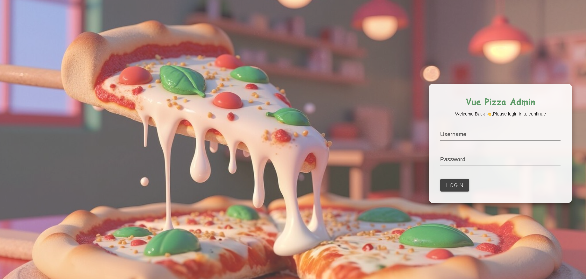
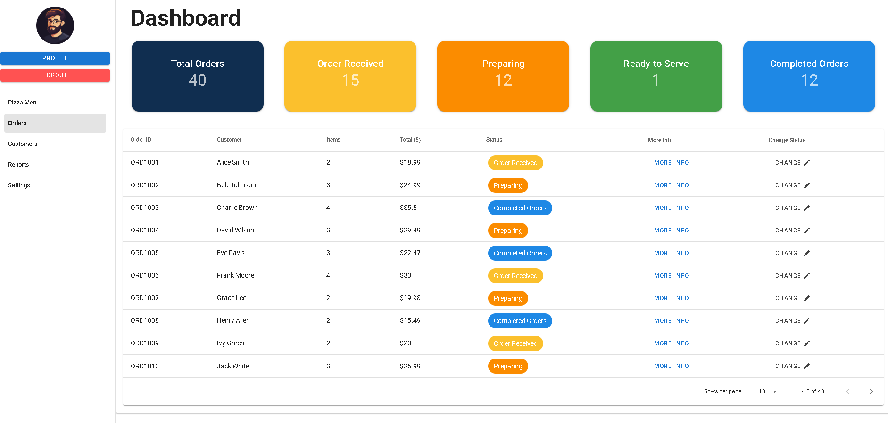
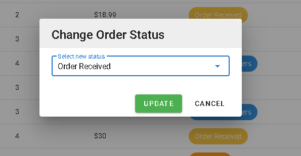
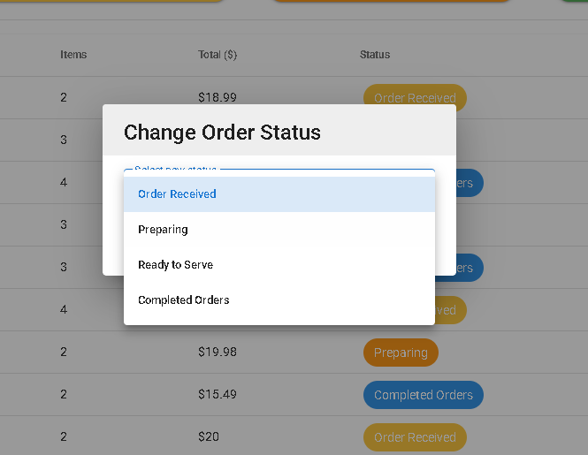
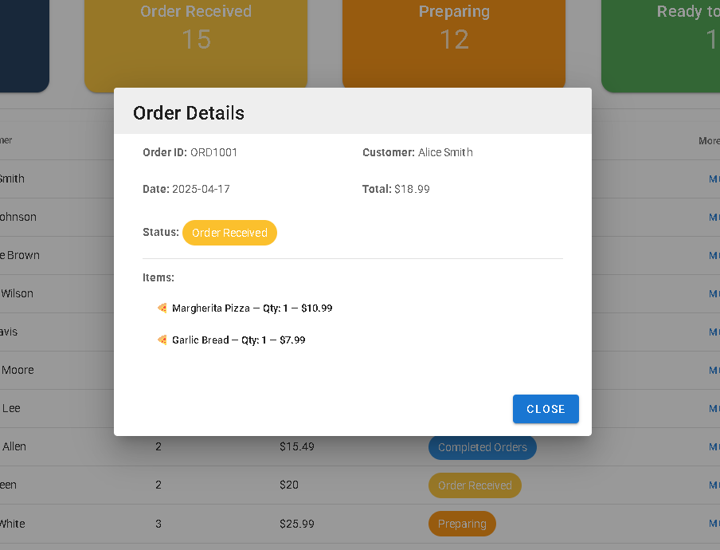

# Vue Pizza Admin

## Project Overview

A Vue.js-based application for managing pizza orders, developed using **Vue 2**, **Vuex**, and **Vuetify 2**. This application allows users to log in, view and manage orders, and change their status (e.g., Preparing, Ready to Serve).

## Features

- **Login Page**: User authentication using Vuex.
  

- **Dashboard**: Displays an orders table with customer details and order status.
  
- **Order Status Overview**: Real-time status cards for various stages of orders.
  
  



- **Vuetify Design**: Clean, responsive UI with Vuetify components.

Overview of Implementation & UI

Login

The project includes a login form.
username: demo
password: demo123

On successful login, the user is redirected to the dashboard.

Dashboard Layout

Displays a side menu bar for navigation.

Shows status cards summarizing order statuses.

Contains a table listing all orders.

Order Table Features

Includes two popups:

One for viewing order details.

Another for changing the status of an order.

After changing the order status, the update is immediately reflected in the status cards.

## Setup

### 1. Clone or Download the Repository

download the zip of the project folder.

### 2. Install Dependencies

Navigate to the project folder and install dependencies:

```bash
npm install
npm run serve

```
